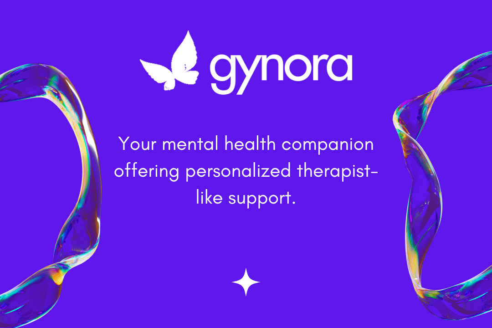

<p align="center" id="top">
	
	<p align="center">⚡ Your AI-powered mental health companion, offering personalized insights and affirmations tailored to your unique needs.</p>
</p>

<div align="center">


[](https://github.com/omzi/gynora/issues)
[](https://opensource.org/licenses/MIT)


</div>

<h4 align="center"><a href="https://gynora.omzi.dev"><i>Live Demo</i> 🚀</a></h4>



---

## 📜 **About**

Gynora is an AI-powered mental health companion, designed to offer personalized chat support & culturally sensitive affirmations.

## ⚙️ **Features**

- [x] Full-Featured Authentication
- [x] Real-Time AI-Powered Chat Support
- [x] Customizable Conversation Tone & Style
- [x] AI-Generated, Culturally Sensitive Affirmations
- [x] Private & Secure Conversations
- [ ] Detailed Chat Insights and Feedback (WIP)
- [ ] Mobile Notifications & Session Reminders (WIP)

## 🛠 **Tech Stack**

- **_FrontEnd_**: TypeScript, Next.js
- **_BackEnd_**: Next.js API Routes, Server Actions, Prisma
- **_Styling_**: Tailwind CSS, shadcn/ui components
- **_Authentication_**: Next Auth
- **_AI Models_**: AssemblyAI's Universal-2, OpenAI's GPT-4o Mini, Google's Gemini 1.5 Flash, OpenAI's TTS-1

## 🚩 **Prerequisites**

Ensure that your system meets the following requirements:

- [Node.js](https://nodejs.org/) version >= 20.15.0
- [npm](https://www.npmjs.com/) version >= 10.3.0

## ⚡ **Installation**

Before proceeding, make sure your system satisfies the prerequisites mentioned above. <br><br>
Firstly, clone the Gynora repository into your desired folder and navigate into it:

```shell
$ git clone https://github.com/omzi/gynora && cd gynora
```

Install the project dependencies using npm (or yarn if you prefer):

```shell
npm i
```

## ⚙ **Environment Variables**

Gynora requires certain environment variables to be set to function properly. Create a `.env` file in the root of your project and add the following variables:

```shell
NODE_ENV = # Your current environment
ASSEMBLY_AI_API_KEY = # Your AssemblyAI API key
OPENAI_API_KEY = # Your OpenAI API key
GOOGLE_GENERATIVE_AI_API_KEY = # Your Google Generative AI API key
BREVO_API_KEY = # Your Brevo API key
SENDER_EMAIL = # Your sender email
SENDER_NAME = # Your sender name
DATABASE_URL = # Your database URL
NEXTAUTH_SECRET = # Your NextAuth secret
NEXTAUTH_URL = # Your NextAuth URL
EDGE_STORE_ACCESS_KEY = # Your Edge Store access key
EDGE_STORE_SECRET_KEY = # Your Edge Store secret key
```

Once the environment variables are set, you can run Gynora locally with:

```shell
npm run dev
```

Visit the URL `https://localhost:9090/` in your browser to access the Gynora application.

## 👥 **Contributors**

- [Omezibe Obioha](https://github.com/omzi/) (@0xOmzi)

## 📄 **License**

This project is licensed under the MIT License. See the [`LICENSE`](./LICENSE) file for more details.

## ❌ **Disclaimer**

Gynora is a work-in-progress submitted to the [AssemblyAI Challenge](https://dev.to/challenges/assemblyai/). You may experience rate limits, errors and/or bugs while testing out the application. Feel free to reach to me on Twitter/X ([@0xOmzi](https://x.com/0xOmzi/)) regarding any issue you might be facing.

---

[Back To Top ↺](#top)

> Made with &#9829;
